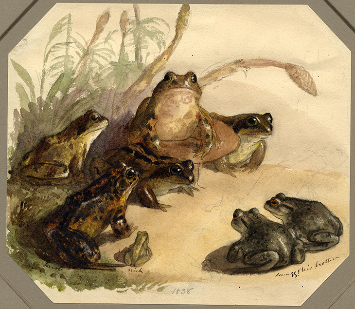

# API 1º Semestre ADS - FATEC

# Imóveis SP - Chatbot Telegram

# Documentação - Sprint 3

  

<h1 align="center">Ribbit</h1>

  | <a href ="#desafio"> Desafio</a>  |
  <a href ="#us"> User Stories</a>  |   
  <a href ="#dor">DoR</a>  |
  <a href ="#dod">DoD</a>  |
  <a href ="#equipe"> Equipe</a> |

> **Status do Projeto:** Em Desenvolvimento ⏳

## 🏅 Desafio 

**Implementar recursos avançados de análise de dados, inteligência de mercado e personalização da experiência do usuário.** O objetivo principal desta entrega final é enriquecer as consultas com prévias detalhadas dos imóveis, fornecer aos vendedores um painel de tendências com os requisitos mais procurados na última semana (utilizando contadores de especificidades) e garantir a retenção de usuários através de um sistema de histórico que permite salvar buscas anteriores para a continuidade de pesquisas de forma simples.

## 📋 User Stories 

| Prioridade | User Story                                                                                                                                                                                   | Story Points | Sprint | Status |
| :--------: | -------------------------------------------------------------------------------------------------------------------------------------------------------------------------------------------- | :----------: | :----: | :----: |
|    Alta    | Como comprador, gostaria de ter prévias apresentações do imóvel para escolher um que esteja de acordo com as necessidades diárias como pontos de interesse próximos.                         |      36      |   3    |   ⏳   |
|    Alta    | Como vendedor, gostaria de saber quais são os requisitos mais procurados pelos compradores no último mês ou semana (utilizando um contador de especificidades).                              |      60      |   3    |   ⏳   |
|    Média   | Como Comprador ou Vendedor, gostaria de um ID de usuário, para que minhas buscas sejam salvas e eu consiga continuar as minhas pesquisas.                                                    |      60      |   1    |   ⏳   |

## 🏅 DoR - Definition of Ready 

|             Critério             | Descrição                                                                                                            |
| :------------------------------: | -------------------------------------------------------------------------------------------------------------------- |
|       Clareza na Descrição       | A User Story está escrita no formato “Como [persona], quero [ação] para que [objetivo]”                              |
| Critérios de Aceitação Definidos | A história possui critérios objetivos que indicam o que é necessário para considerá-la concluída.                    |
| Cenários de Teste Especificados  | A história tem pelo menos 1 cenário de teste estruturado (Dado, Quando, Então).                                      |
|           Independente           | A história pode ser implementada sem depender de outra tarefa da mesma Sprint.                                       |
|    Compreensão Compartilhada     | Toda a equipe (incluindo PO e devs) compreende o propósito da história.                                              |
|            Estimável             | A história foi pontuada no Planning Poker ou tem uma estimativa clara.                                               |
|       Documentos de Apoio        | Se necessário, mockups, fluxos ou modelos de dados estão anexados ou referenciados.                                  |
|   Critérios técnicos acordados   | As necessidades do Telegram e das Funcionalidades locais foram claramente separadas (quando aplicável).              |

## 🏅 DoD - Definition of Done 

|                 Critério                 | Descrição                                                                            |
| :--------------------------------------: | ------------------------------------------------------------------------------------ |
|     Critérios de Aceitação atendidos     | Todos os cenários de teste da história foram executados e aprovados.                 |
|        Testes manuais realizados         | Onde aplicável, os dados são corretamente armazenados.                               |
|             Código revisado              | O código foi revisado por pelo menos um colega de equipe.                            |
|     Documentação interna atualizada      | Foi atualizado o que for necessário: API, estrutura de dados, Telegram, etc.         |
|  Integração com outras partes testadas   | As interfaces entre Telegram e ferramentas locais foram validadas.                   |
| Build/Testes automatiados (se aplicável) | A funcionalidade não quebra a aplicação e passa nos testes automatizados existentes. |
|             Validação do PO              | O Product Owner validou a entrega com base nos critérios definidos.                  |
|            Pronto para deploy            | O item está testado, validado e pode ser integrado ao produto final.                 |

## 🎓 Equipe 

  <table>
    <tr>
      <th>Membro</th>
      <th>Função</th>
      <th>Github</th>
    </tr>
    <tr>
      <td>Arthur</td>
      <td>Desenvolvedor</td>
      <td>
    </tr>
    <tr>
      <td>Camila</td>
      <td>Desenvolvedor</td>
      <td>
    </tr>
    <tr>
      <td>Guilherme</td>
      <td>Desenvolvedor</td>
      <td>
    </tr>
    <tr>
      <td>José</td>
      <td>Desenvolvedor</td>
      <td>
    </tr>
    <tr>
      <td>Larissa</td>
      <td>Desenvolvedor</td>
      <td>
    </tr>
    <tr>
      <td>Miguel</td>
      <td>Desenvolvedor</td>
      <td>
    </tr>
    <tr>
      <td>Thais</td>
      <td>Desenvolvedor</td>
      <td>
    </tr>
    <tr>
      <td>Ulisses</td>
      <td>Desenvolvedor</td>
      <td>
    </tr>
    <tr>
      <td>Wilian</td>
      <td>Desenvolvedor</td>
      <td>
    </tr>
    <tr>
      <td>Vinícius</td>
      <td>Desenvolvedor</td>
      <td>-</td>
    </tr>
  </table>

